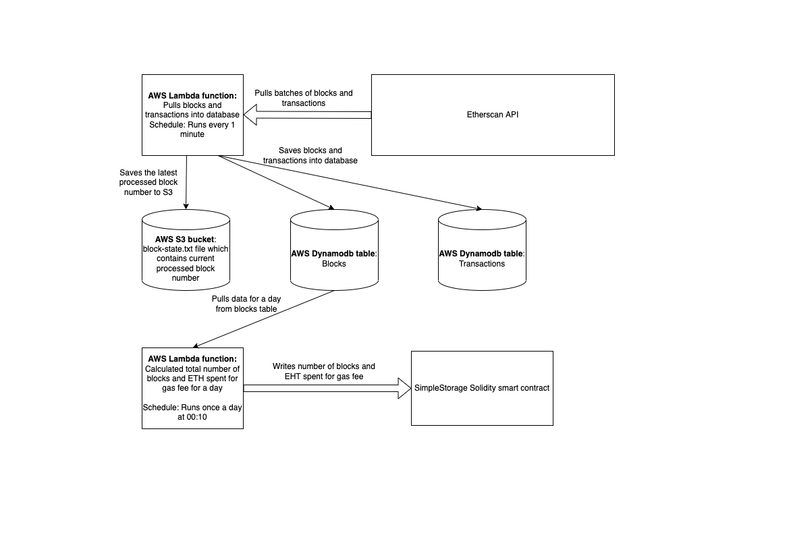

## Setup:

- `git clone git@github.com:aburkut/eth-blocks.git cd eth-blocks`
- `nvm use 14.17`
- `npm install`

### NPM scripts:
- `npm run build` - compile TS files and install deps for dist folder
- `npm run start:dev:puller` - runs puller service (for local development)
- `npm run start:dev:calc` - runs calc service (for local development)
- `npm run deploy:contract` - deploy smart contract to specific network
- `npm test` - runs tests
- `npm run lint` - runs eslint checks
- `npm run lint:fix` - runs eslint checks and fixes problems

## Environment variables:

For reference look at [.env-example](.env-example) file

- `ETHERSCAN_API_KEY=xx` - API_KEY value for Etherscan https://etherscan.io/
- `ETHERSCAN_NETWORK=xxx` - network (homestead, ropsten, etc.) for Etherscan
- `BLOCK_START=xxx` - optional, the value indicates for which block number to start
- `BLOCKS_DDB_TABLE=blocks` - AWS Dynamodb table name where blocks will be stored
- `TRANSACTIONS_DDB_TABLE=transactions` - AWS Dynamodb tbale name where transactions will be stored
- `AWS_ACCESS_KEY_ID=xxx` - AWS access key id
- `AWS_SECRET_ACCESS_KEY=xxx` - AWS secret access key
- `AWS_REGION=us-east-1` - AWS region
- `STATE_BUCKET=eth-blocks-state` - AWS S3 bucket 
- `BLOCKS_STATE_FILE=blocks-state.txt` - AWS S3 state file to store state file with current processed block number
- `SMART_CONTRACT_NETWORK=ropsten` - network where smart contract will be deployed
- `SMART_CONTRACT_ADDRESS=xxx` - smart contract address
- `PRIVATE_KEY=xxx` - private key to iteract with smart contract

## Architecture:

- Two AWS scheduled AWS Lambda functions - puller and calc.
- Database - AWS Dynamodb 

## Directory structure
- [contracts](contracts) - contains Solidity smart contract, abi.json, and simple TS script to deploy the contract to network
- [src](src) - contains source code of Node.js AWS Lambda functions
- [terraform](terraform) - contains terraform templates to provision AWS resources required by the application
- [test](test) - contains tests

## Terraform

To provision AWS resources need to run the following steps:
- `npm run build` to compile TS files and create dist folder that will be deployed as AWS lambda function by terraform
- `cd terraform`
- `export AWS_ACCESS_KEY_ID=xxx` & `export AWS_SECRET_ACCESS_KEY=xxx` to give terraform access to AWS cloud
- `terraform init` to download providers and modules
- `terraform plan` to see which AWS  resources will be created
- `terraform apply ` to provision infrastructure

## Technical details:

The lambda functions a built on the top on [Nest.js framework](https://nestjs.com/) and Typescript.
